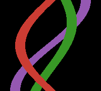

# Sinograms.jl
Julia library for working with
sinograms / tomography / Radon transform / cone-beam CT / CBCT

https://github.com/JuliaImageRecon/Sinograms.jl

[![docs-stable][docs-stable-img]][docs-stable-url]
[![docs-dev][docs-dev-img]][docs-dev-url]
[![action][action-img]][action-url]
[![Aqua QA][aqua-img]][aqua-url]
[![codecov][codecov-img]][codecov-url]
[![deps][deps-img]][deps-url]
[![license][license-img]][license-url]
[![pkgeval][pkgeval-img]][pkgeval-url]
[![version][ver-img]][ver-url]

See the examples under the blue "docs" badges above.

Tested with Julia ≥ 1.12.

### Related packages in Julia

* [JuliaImageRecon](https://github.com/JuliaImageRecon)
* [Michigan Image Reconstruction Toolbox (MIRT)](https://github.com/JeffFessler/MIRT.jl)
* [RadonKA.jl with CUDA and multithreading support](https://github.com/roflmaostc/RadonKA.jl)
* https://github.com/JuliaImages/ImageReconstruction.jl (`radon`, `iradon`)
* https://github.com/JuliaImageRecon/SPECTrecon.jl
* https://github.com/MolloiLab/BasisSimulator.jl (GPU-portable polychromatic CT simulator)

### Related packages in other languages

* See the Tomopedia list: https://tomopedia.github.io/software
* CASToR https://castor-project.org
* Duke MCR todo
* FreeCT https://gitlab.com/freect/freect C/CUDA
* SIRF https://github.com/SyneRBI/SIRF

<!-- URLs -->
[action-img]: https://github.com/JuliaImageRecon/Sinograms.jl/workflows/CI/badge.svg
[action-url]: https://github.com/JuliaImageRecon/Sinograms.jl/actions

[codecov-img]: https://codecov.io/github/JuliaImageRecon/Sinograms.jl/coverage.svg
[codecov-url]: https://codecov.io/github/JuliaImageRecon/Sinograms.jl

[deps-img]: https://juliahub.com/docs/Sinograms/deps.svg
[deps-url]: https://juliahub.com/ui/Packages/Sinograms

[docs-dev-img]: https://img.shields.io/badge/docs-dev-blue.svg
[docs-dev-url]: https://JuliaImageRecon.github.io/Sinograms.jl/dev
[docs-stable-img]: https://img.shields.io/badge/docs-stable-blue.svg
[docs-stable-url]: https://JuliaImageRecon.github.io/Sinograms.jl/stable

[license-img]: https://img.shields.io/badge/license-MIT-brightgreen.svg
[license-url]: LICENSE

[pkgeval-img]: https://juliaci.github.io/NanosoldierReports/pkgeval_badges/S/Sinograms.svg
[pkgeval-url]: https://juliaci.github.io/NanosoldierReports/pkgeval_badges/S/Sinograms.html

[ver-img]: https://juliahub.com/docs/Sinograms/version.svg
[ver-url]: https://juliahub.com/ui/Packages/Sinograms
